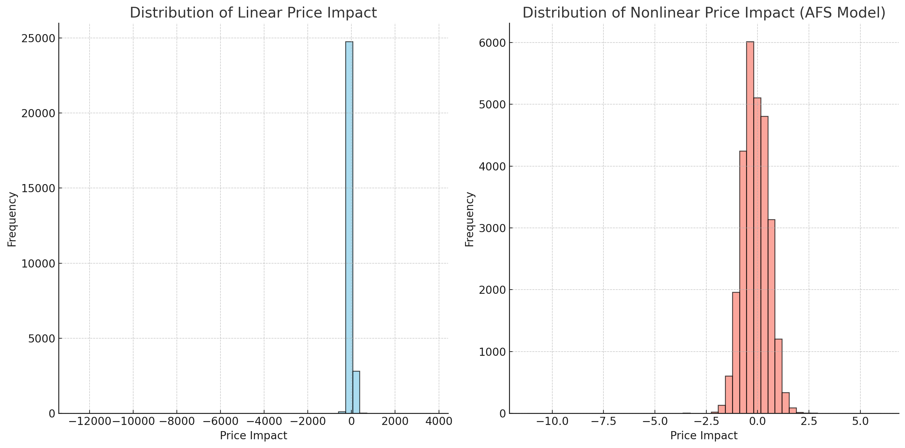
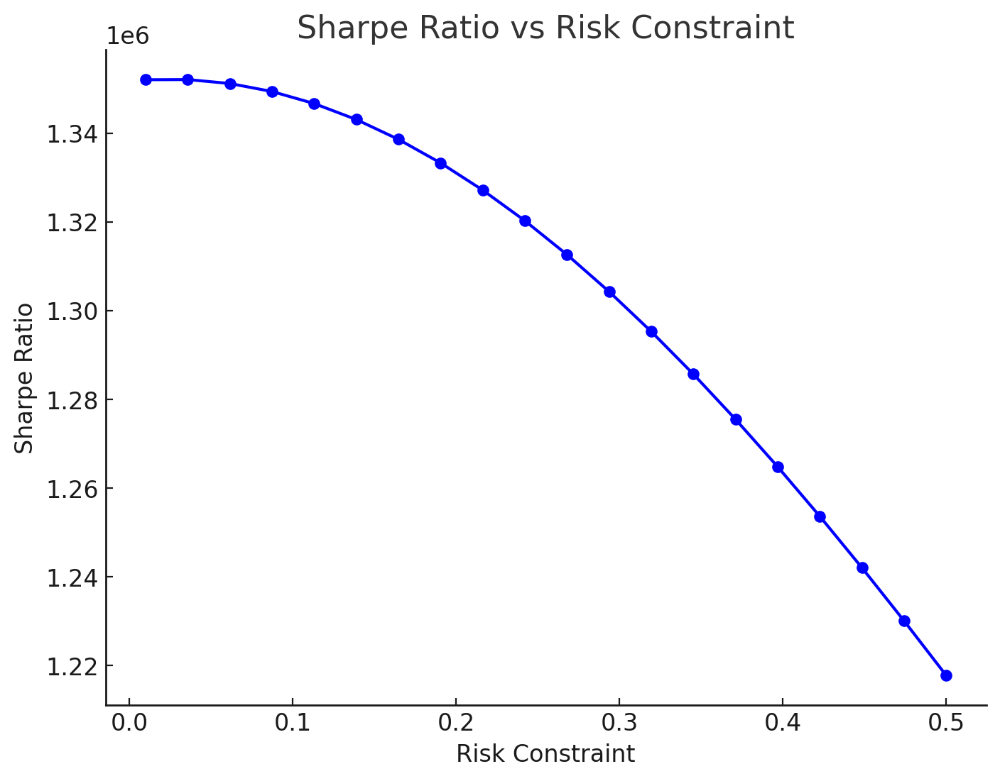
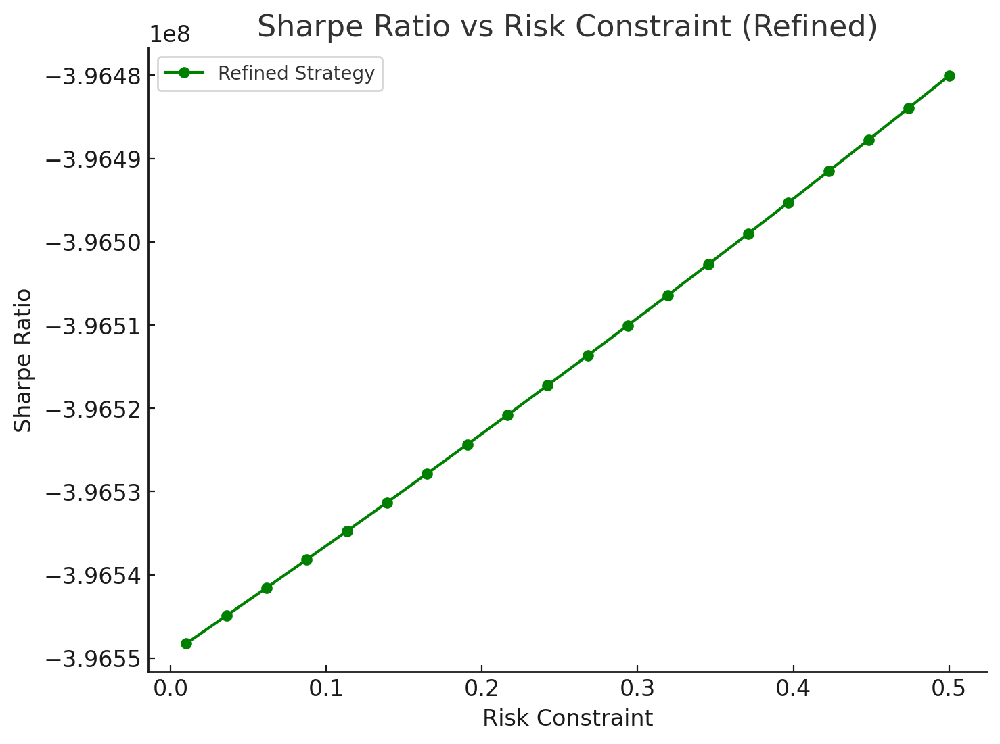
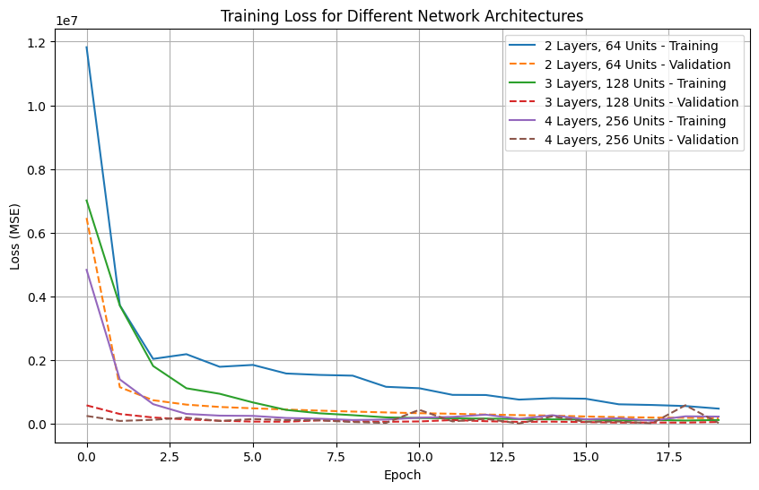

# BlockHouse - Efficient Trading with Price Impact

This repository contains the implementation of tasks related to the replication of the research paper **"Efficient Trading with Price Impact"**. The repository provides code, analysis, and visualizations to understand trading strategies, their optimization, and performance evaluation using linear and nonlinear price impact models.

---

## 📜 Overview

The tasks implemented include:
1. **Linear OW and Nonlinear AFS Models**: Construction, coding, and visualization of price impact distributions for linear and nonlinear models.
2. **Optimal Strategy with Linear Impact**: Implementation of the optimal strategy, including Sharpe Ratio analysis.
3. **Deep Learning for Discrete Settings**: Implementation of neural network-based trading strategies, including performance visualizations and architecture comparisons.

Each task is supported by visual outputs and well-documented code.

---

## 🖥️ Tasks and Outputs

### Task 1: Linear OW and Nonlinear AFS Models
- **Objective**: Visualize the distribution of price impact for linear and nonlinear models.
- **Key Outputs**:
  

The image above shows the distribution of price impact for both linear and nonlinear models based on the data provided.

---

### Task 2: Optimal Strategy with Linear Impact
- **Objective**: Implement and evaluate the optimal trading strategy using a linear impact model.
- **Key Outputs**:
  

  

The initial Sharpe Ratio (left) and the refined Sharpe Ratio (right) plots show improvements after parameter calibration and incorporating nonlinear features.

#### Sharpe Ratio Across Scenarios
  

The Sharpe ratio visualization highlights strategy performance under high volatility, high trading volume, and price shock scenarios.

---

### Task 3: Deep Learning for Discrete Settings
- **Objective**: Implement neural networks for trading optimization in discrete settings.
- **Key Outputs**:
  

The chart above compares the training loss across different neural network architectures, showcasing their performance for the task.

---

## 🚀 Getting Started

### Prerequisites
- **Programming Language**: Python 3.8+
- **Libraries**:
  - `tensorflow` for deep learning.
  - `numpy`, `pandas`, and `matplotlib` for data processing and visualization.

---

### Installation
Clone the repository and install the required dependencies:
